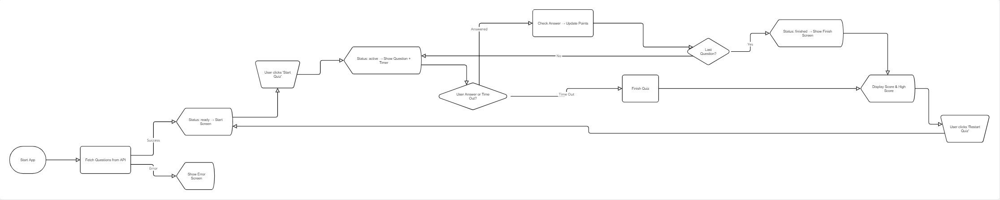

# 🧠 React Quiz App

An interactive **quiz application built with React** that displays multiple-choice questions, tracks your progress, and includes a **countdown timer** for each question.  
When time runs out or the user finishes all questions, a **finish screen** appears showing the score and high score.

---

## ✨ Features

- ⚙️ Built with **React + useReducer** for clean state management
- ⏱️ **Dynamic countdown timer** with `useEffect` + `setInterval`
- 🌐 Questions fetched from a **Fake API** using [My JSON Server](https://my-json-server.typicode.com/)
- 🧩 Includes loading, error, start, quiz, and finish screens
- 💾 Tracks your **score** and **high score**
- 🧠 Shows question progress and total achievable points
- 💡 Simple and elegant UI with pure CSS

---

## 🧱 Project Structure

``src/
│── components/
│   ├── DateCounter.js 
│   ├── Error.js 
│   ├── FinishScreen.js 
│   ├── Footer.js 
│   ├── Header.js 
│   ├── Loader.js 
│   ├── Main.js 
│   ├── NextBtn.js 
│   ├── Options.js 
│   ├── Progress.js 
│   ├── Question.js 
│   ├── StartScreen.js 
│   └── Timer.js 
│── App.js 
│── index.css 
│── index.js``

---

## 🧩 Flowchart

  

---

## 🚀 How to Run Locally

1.  **Clone the repo:**

    `git clone https://github.com/RamezKhaled77/react-quiz-app.git`

2.  **Install dependencies:**

    `npm install`

3.  **Run the development server:**

    `npm start`

4.  The app will be available at [http://localhost:3000](http://localhost:3000)

---

## 🧠 How It Works

- Questions are fetched from a **Fake API**:

  `https://my-json-server.typicode.com/RamezKhaled77/react-questions-api/questions`

- Each question gives the user **20 seconds** to answer.
- The app uses a **Reducer** to manage states like:

  - `loading` → while fetching questions
  - `ready` → waiting to start
  - `active` → quiz in progress
  - `finished` → when quiz ends

- When time runs out or the last question is answered, the **Finish Screen** displays the final score.

---

## 🧰 Technologies Used

- ⚛️ React (Hooks: `useReducer`, `useEffect`)
- 🎨 CSS3 for styling
- 🌐 My JSON Server for mock API

---

## 🌟 Future Improvements

- ✅ Add **difficulty levels** (easy / medium / hard)
- ✅ Add **category selection**
- ✅ Store high scores in **Local Storage**
- ✅ Add **sound effects or animations**
- ✅ Enhance design with **Tailwind CSS** or **Framer Motion**

---

## 📜 License

This project is open-source under the **MIT License** — feel free to use, modify, and share it.
